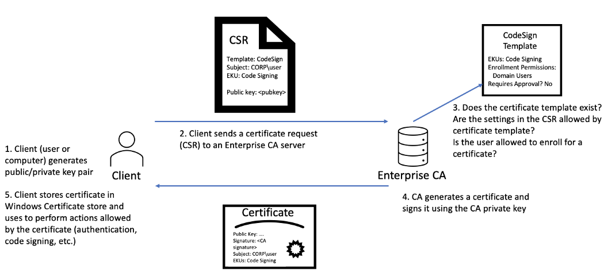

# Active Directory Certificate Services
AD CS est l'implémentation de l'infrastructure à clés publiques (PKI) de Microsoft.

AD CS est une fonction privilégiée, et s'exécute normalement sur des contrôleurs de domaine sélectionnés. AD CS est utilisé pour plusieurs choses:

- Le chiffrement des systèmes de fichiers
- La création et la vérification des signatures numériques
- L'authentification des utilisateurs, ce qui en fait une voie prometteuse pour les attaquants. 

> Les certificats peuvent survivre à la rotation des informations d'identification, ce qui signifie que même si le mot de passe d'un compte compromis est réinitialisé, cela ne fera rien pour invalider le certificat généré de manière malveillante, ce qui permet un vol d'informations d'identification persistant jusqu'à 10 ans ! 

Flux de demandes et de génération de certificats : 

# Privilèges d'utilisateur de domaine par défaut
Par défaut, tout utilisateur membre du groupe Utilisateurs authentifiés (littéralement tous les comptes AD) peut inscrire jusqu'à 10 nouvelles machines sur le domaine.

Cette méthode est souvent utilisée dans les organisations pour permettre aux utilisateurs d'apporter leur propre appareil (BYOD) et de l'inscrire pour une utilisation sur le domaine. Ce n'est pas vraiment une vulnérabilité en soi, mais elle a conduit à des vecteurs d'escalade de privilèges.

Lorsque nous inscrivons un nouvel hôte dans AD , nous sommes désignés comme **propriétaire** de cet hôte. Cela nous donne certaines autorisations sur l' objet AD associé à cet hôte. 

Deux autorisations en particulier posent problème ici :
- **Valider l'écriture sur le nom d'hôte DNS** - Cette autorisation nous permet de mettre à jour le nom d'hôte DNS de notre objet AD associé à l'hôte.

- **Valider l’écriture sur le nom principal du service (SPN)** - Cette autorisation nous permet de mettre à jour le SPN de notre objet AD associé à l’hôte.

# Terminologie

- **PKI (Public Key Infrastructure)** - est un système qui gère les certificats et le cryptage à clé publique.
    
- **AD CS (Active Directory Certificate Services)** - est l'implémentation PKI de Microsoft qui s'exécute généralement sur les contrôleurs de domaine.

- **CA (Certificate Authority)** - est une PKI qui délivre des certificats.
    
- **Modèle de certificat** - un ensemble de paramètres et de politiques qui définit comment et quand un certificat peut être émis par une autorité de certification

- **CSR (Certificate Signing Request)** - est un message envoyé à une autorité de certification pour demander un certificat signé.

- **EKU (Extended/Enhanced Key Usage)** - sont des identifiants d'objet qui définissent comment un certificat généré peut être utilisé

Certipy est un outil offensif pour l'énumération et l'exploitation des vulnérabilités et des erreurs de configuration d'AD CS