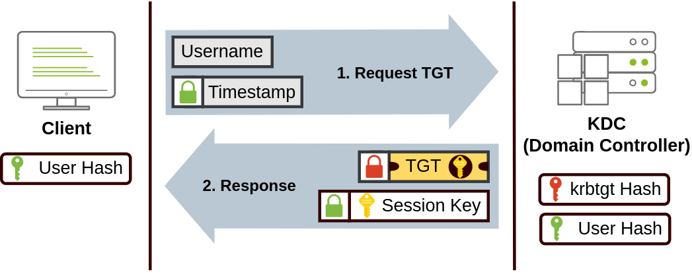
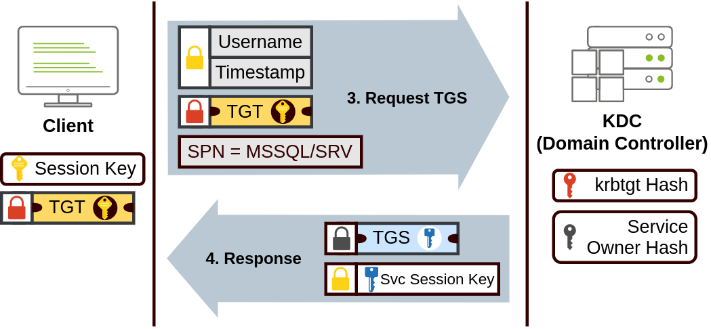
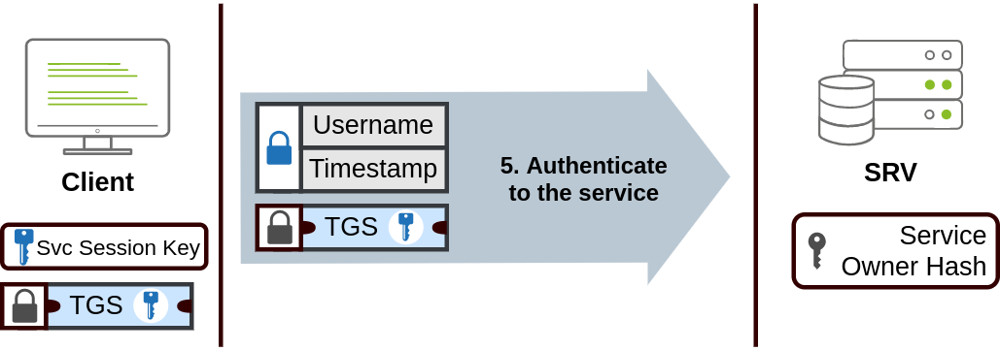
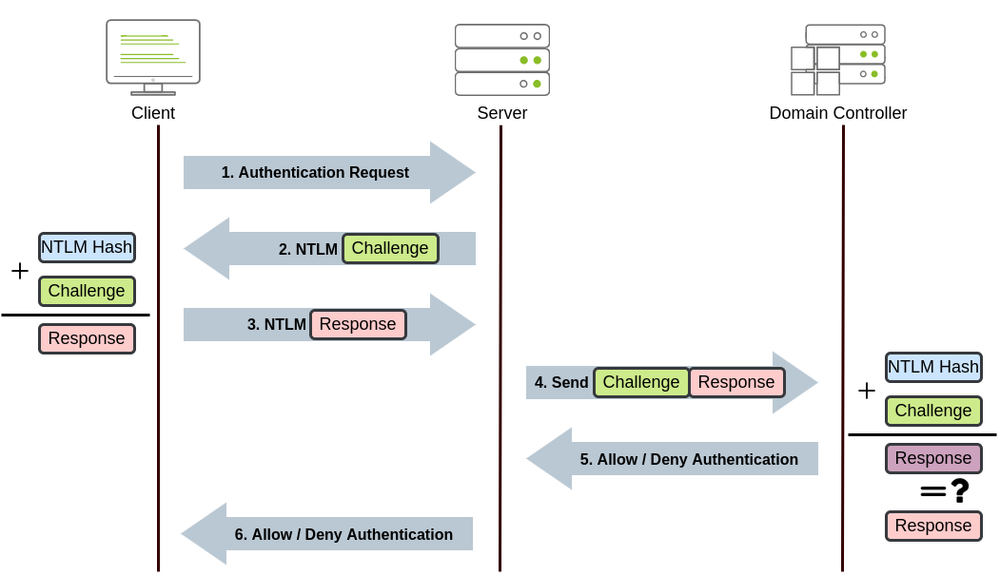
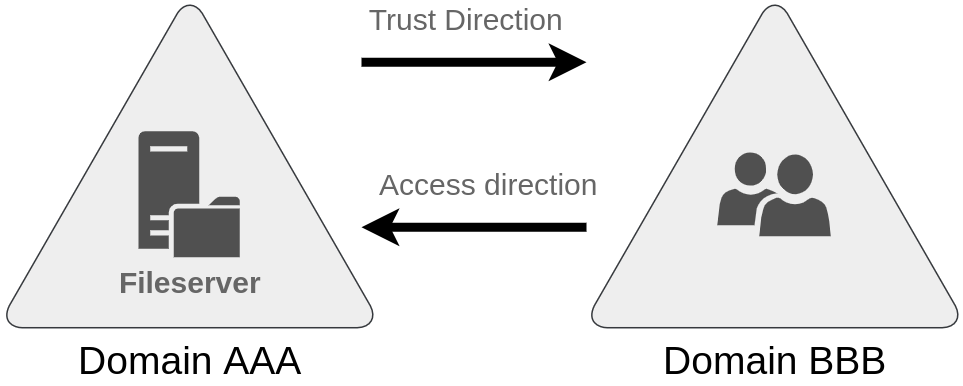

# Active Directory

Active Directory simplifie la gestion des appareils et des utilisateurs dans un environnement d'entreprise.

- Le serveur qui exécute les services AD est appelé **Contrôleur de Domaine (DC)**

- Le serveur qui exécute les certificates de service est appelé [Active Directory Certificate Services](AD%20CS.md) (ADCS)


> Le cœur de tout domaine Windows est le **Service de Domaine Active Directory (ADDS)** qui agit comme un catalogue contenant les informations de tous les « `objets` » qui existent sur le réseau. 
> Ses objets peuvent être : des utilisateurs, des groupes, des machines, des imprimantes, des partages et bien d'autres.

# Utilisateurs
Les utilisateurs sont l'un des objets appelés **principes de sécurité (Security Principals)**
ce qui signifie qu'ils peuvent être authentifiés par le domaine et se voir attribuer des privilèges sur **des ressources** telles que des fichiers ou des imprimantes.

Les utilisateurs peuvent être utilisés pour représenter deux types d'entités :
 
- **Personnes (People) :** les utilisateurs représenteront généralement les personnes de l'organisation qui doivent accéder au réseau, comme les employés.

- **Services :** vous pouvez également définir des utilisateurs qui seront utilisés par des services comme IIS ou MSSQL. Chaque service nécessite l'exécution d'un utilisateur, mais les utilisateurs du service sont différents des utilisateurs réguliers car ils n'auront que les privilèges nécessaires pour exécuter leur service spécifique.

> __NB:__ Une entité de sécurité est un objet qui peut agir sur les ressources du réseau.

# Ordinateurs
Pour chaque ordinateur qui rejoint le domaine Active Directory, un objet machine sera créé. Les machines sont également considérées comme des « principaux de sécurité » et se voient attribuer un compte comme n'importe quel utilisateur régulier. 

Ce compte a des droits quelque peu limités au sein du domaine lui-même.

L’identification des comptes machine est relativement simple. Par exemple, une machine nommée `DC01` aura un compte de machine appelé `DC01$`.

# Groupes
Les groupes peuvent avoir à la fois des utilisateurs et des machines comme membres. Si nécessaire, les groupes peuvent également inclure d'autres groupes.

> Les groupes de sécurité sont également considérés comme des entités de sécurité et peuvent donc disposer de privilèges sur les ressources du réseau. Utilisés pour accorder des autorisations sur les ressources

| **Groupe de sécurité**                      | **Description**                                                                                                                                                                                                 |
| ------------------------------------------- | --------------------------------------------------------------------------------------------------------------------------------------------------------------------------------------------------------------- |
| Administrateurs de domaine (Domain Admins)  | Les utilisateurs de ce groupe disposent de privilèges administratifs sur l'ensemble du domaine. Par défaut, ils peuvent administrer n’importe quel ordinateur du domaine, y compris les contrôleurs de domaine. |
| Opérateurs de serveur (Server Operators)    | Les utilisateurs de ce groupe peuvent administrer les contrôleurs de domaine. Ils ne peuvent modifier aucune appartenance à un groupe administratif.                                                            |
| Opérateurs de sauvegarde (Backup Operators) | Les utilisateurs de ce groupe sont autorisés à accéder à n'importe quel fichier, en ignorant leurs autorisations. Ils sont utilisés pour effectuer des sauvegardes de données sur les ordinateurs.              |
| Opérateurs de comptes (Account Operators)   | Les utilisateurs de ce groupe peuvent créer ou modifier d'autres comptes dans le domaine.                                                                                                                       |
| Utilisateurs du domaine (Domain User)       | Inclut tous les comptes d'utilisateurs existants dans le domaine.                                                                                                                                               |
| Ordinateurs du domaine (Domain Computers)   | Inclut tous les ordinateurs existants dans le domaine.                                                                                                                                                          |
| Contrôleurs de domaine (Domain Controller)  | Inclut tous les contrôleurs de domaine existants sur le domaine.

Liste complète des groupes de sécurité dans la [documentation Microsoft](https://docs.microsoft.com/en-us/windows/security/identity-protection/access-control/active-directory-security-groups) 


# Les unités d'organisation
Les unités d'organisation (Organizational Units) sont principalement utilisées pour définir des ensembles d'utilisateurs ayant des exigences de contrôle similaires.

> Un utilisateur ne peut faire partie que d’une seule unité d’organisation à la fois.


# Délégation
Permet d'accorder aux utilisateurs des privilèges spécifiques pour effectuer des tâches avancées sur les unités d'organisation sans avoir besoin de l'intervention d'un administrateur de domaine.

# Objets de stratégie de groupe (GPO)
Les utilisateurs et les ordinateurs sont organisé en unités d'organisation car l'idée principale derrière cela est de pouvoir déployer différentes politiques pour chaque unité d'organisation individuellement. 

De cette façon, nous pouvons proposer différentes configurations et bases de sécurité aux utilisateurs en fonction de leur service.


Windows gère ces politiques via **des objets de stratégie de groupe ( GPO )** qui sont simplement un ensemble de paramètres pouvant être appliqués aux unités d’organisation et peuvent contenir des stratégies destinées aux `utilisateurs` ou aux `ordinateurs`, vous permettant de définir une référence sur des machines et des identités spécifiques.


# Méthodes d'authentification
Lors de l'utilisation de domaines Windows, toutes les informations d'identification sont stockées dans les contrôleurs de domaine. Chaque fois qu'un utilisateur tente de s'authentifier auprès d'un service à l'aide des informations d'identification de domaine, le service devra demander au contrôleur de domaine de vérifier si elles sont correctes. 

Deux protocoles peuvent être utilisés pour l'authentification réseau dans les domaines Windows :

- Kerberos 
- NetNTLM (obsolète)

## Kerberose
Les utilisateurs qui se connectent à un service à l'aide de Kerberos se verront attribuer des tickets (une preuve d'une authentification antérieure).

Les utilisateurs disposant de tickets peuvent les présenter à un service pour démontrer qu'ils se sont déjà authentifiés sur le réseau auparavant et qu'ils sont donc autorisés à l'utiliser.

Le processus d'authentification est le suivant:





1. L'utilisateur envoie son nom d'utilisateur et un horodatage crypté à l'aide d'une clé dérivée de son mot de passe au **Key Distribution Center (KDC)** , un service installé sur le DC en charge de créer des tickets Kerberos sur le réseau.

2. Le KDC créera et renverra un **Ticket Granting Ticket ( TGT )** , qui permettra à l'utilisateur de demander des billets supplémentaires pour accéder à des services spécifiques. 

> La nécessité d'un ticket pour obtenir plus de tickets permet aux utilisateurs de demander des tickets de service sans transmettre leurs informations d'identification à chaque fois qu'ils souhaitent se connecter à un service. Avec le TGT , une **clé de session** est remise à l'utilisateur, dont il aura besoin pour générer les requêtes suivantes.
    
> Notez que le TGT est crypté à l'aide du hachage du mot de passe du compte **krbtgt** et que l'utilisateur ne peut donc pas accéder à son contenu. Il est essentiel de savoir que le TGT chiffré inclut une copie de la clé de session dans son contenu, et que le KDC n'a pas besoin de stocker la clé de session car il peut récupérer une copie en déchiffrant le TGT si nécessaire.

3. Lorsqu'un utilisateur souhaite se connecter à un service sur le réseau comme un partage, un site Web ou une base de données, il utilisera son TGT pour demander au KDC un **service d'octroi de tickets (TGS)** . 

> Les TGS sont des tickets qui permettent la connexion uniquement au service spécifique pour lequel ils ont été créés. Pour demander un TGS, l'utilisateur enverra son nom d'utilisateur et un horodatage crypté à l'aide de la clé de session, ainsi que le TGT et un **nom principal de service (SPN),** qui indique le nom du service et du serveur auquel nous avons l'intention d'accéder.

4. En conséquence, le KDC nous enverra un TGS accompagné d'une **clé de session de service** , dont nous aurons besoin pour nous authentifier auprès du service auquel nous souhaitons accéder. 

> Le TGS est chiffré à l'aide d'une clé dérivée du  **Service Owner Hash** . Le propriétaire du service est le compte utilisateur ou machine sous lequel le service s'exécute. Le TGS contient une copie de la clé de session de service sur son contenu crypté afin que le propriétaire du service puisse y accéder en déchiffrant le TGS.

5. Le TGS peut ensuite être envoyé au service souhaité pour s'authentifier et établir une connexion. Le service utilisera le hachage du mot de passe de son compte configuré pour déchiffrer le TGS et valider la clé de session de service.


## NetNTLM
Fonctionne en utilisant un mécanisme défi-réponse.  Le processus d'authentification est le suivant:



1. Le client envoie une demande d'authentification au serveur auquel il souhaite accéder.

2. Le serveur génère un nombre aléatoire et l'envoie comme défi au client.

3. Le client combine son hachage de mot de passe NTLM avec le défi (et d'autres données connues) pour générer une réponse au défi et la renvoie au serveur pour vérification.

4. Le serveur transmet le défi et la réponse au contrôleur de domaine pour vérification.

5. Le contrôleur de domaine utilise le défi pour recalculer la réponse et la compare à la réponse originale envoyée par le client. S'ils correspondent tous les deux, le client est authentifié ; sinon, l'accès est refusé. Le résultat de l'authentification est renvoyé au serveur.

6. Le serveur transmet le résultat de l'authentification au client.

> Le processus décrit s'applique lors de l'utilisation d'un compte de domaine et que Le mot de passe (ou hachage) de l'utilisateur n'est jamais transmis via le réseau.

> Si un compte local est utilisé, le serveur peut vérifier lui-même la réponse au défi sans nécessiter d'interaction avec le contrôleur de domaine, car le hachage du mot de passe est stocké localement sur son SAM.

# Arbres, Forêts et Trusts 

## Arbres
Permet l'intégration de plusieurs domaines qui peuvent être joints dans un **Tree**.

Imaginons un domaine `microsoft.local` divisé en deux sous-domaines pour les branches britanniques et américaines, on peut pourriez créer une arborescence avec un domaine racine de `microsoft.local`et deux sous-domaines appelés `uk.microsoft.local`et `us.microsoft.local`, chacun avec son AD , ses ordinateurs et ses utilisateurs.

```
└───microsoft.local
    ├───uk.microsoft.local
    └───us.microsoft.local
```

Cette structure partitionnée nous permet de mieux contrôler qui peut accéder à quoi dans le domaine.

> Un nouveau groupe de sécurité doit être introduit lorsqu'on parle d'arbres et de forêts. Le groupe **Administrateurs d'entreprise** accordera à un utilisateur des privilèges administratifs sur tous les domaines d'une entreprise.

## Forêts

L'union de plusieurs arbres avec des espaces de noms différents dans le même réseau est appelée **forêt**

## Relations de confiance
La relations de confiance entre les domaines permet d'autoriser un utilisateur du domaine `uk.microsoft.local` à accéder aux ressources du domaine `us.microsoft.local`.

- La relation de confiance la plus simple qui puisse être établie est une **relation de confiance à sens unique** . 

Dans une approbation unidirectionnelle, si `Domain AAA` trusts `Domain BBB`, cela signifie qu'un utilisateur sur BBB peut être autorisé à accéder aux ressources sur AAA



> Le sens de la relation de confiance à sens unique est contraire à celui du sens d'accès.

- **Des relations de confiance bidirectionnelles** peuvent également être établies pour permettre aux deux domaines d'autoriser mutuellement les utilisateurs de l'autre. Par défaut, joindre plusieurs domaines sous une arborescence ou une forêt formera une relation de confiance bidirectionnelle.
