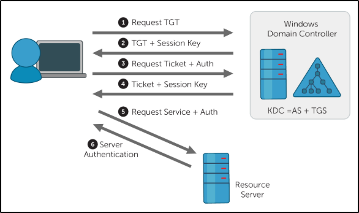

# Terminologie AD

- **Ticket Granting Ticket ( TGT )** - Un ticket d'octroi de ticket est un ticket d'authentification utilisé pour demander des tickets de service au TGS pour des ressources spécifiques du domaine.

- **Key Distribution Center (KDC)** - Le centre de distribution de clés est un service d'émission de TGT et de tickets de service composé du service d'authentification et du service d'octroi de tickets.

- **Authentication Service (AS)** - Le service d'authentification émet des TGT à utiliser par le TGS dans le domaine  pour demander l'accès à d'autres machines et tickets de service.

- **Ticket Granting Service (TGS)** - Le service d'octroi de tickets prend le TGT et renvoie un ticket à une machine sur le domaine.  
    
- **Service Principal Name (SPN)** - Un nom principal de service est un identifiant donné à une instance de service pour associer une instance de service à un compte de service de domaine. Windows exige que les services disposent d'un compte de service de domaine, c'est pourquoi un service a besoin d'un ensemble de SPN.

- **KDC Long Term Secret Key (KDC LT Key)**  - La clé KDC est basée sur le compte de service KRBTGT. Elle est utilisée pour crypter le TGT et signer le PAC.

- **Client Long Term Secret Key (Client LT Key)**  - La clé client est basée sur l'ordinateur ou le compte de service. Elle est utilisée pour vérifier l'horodatage chiffré et chiffrer la clé de session.

- **Service Long Term Secret Key (Service LT Key)**  - La clé de service est basée sur le compte de service. Elle est utilisée pour crypter la partie service du ticket de service et signer le PAC.

- **Session Key** - Émise par le KDC lorsqu'un TGT est émis. L'utilisateur fournira la clé de session au KDC avec le TGT lors de la demande d'un ticket de service.

- **Privilege Attribute Certificate (PAC)** - Le PAC contient toutes les informations pertinentes de l'utilisateur, il est envoyé avec le TGT au KDC pour être signé par la clé LT cible et la clé LT du KDC afin de valider l'utilisateur.