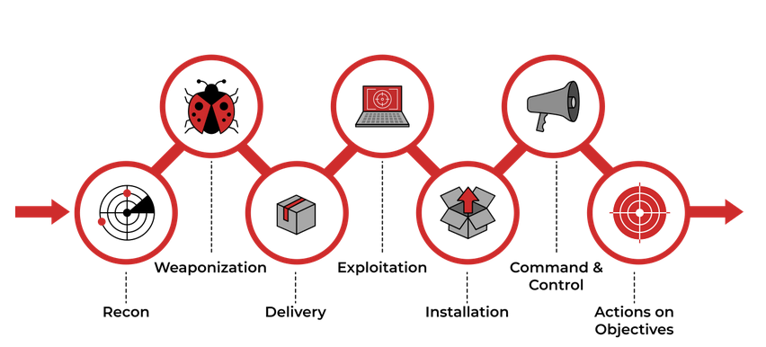

# Cyber Kill Chain®
Conçu pour l’identification et la prévention des intrusions sur le réseau. 

## Reconnaissance
C'est la phase de planification pour les adversaires qui consiste à découvrir et à collecter des informations sur le système et la victime. En utilisent des sites de médias sociaux tels que LinkedIn, Facebook, Twitter et Instagram pour collecter des informations sur une victime spécifique qu'il souhaiterait attaquer ou sur l'entreprise.

**OSINT** (Open-Source Intelligence) est la première étape qu’un attaquant doit accomplir pour mener à bien les phases suivantes d’une attaque en collectant toutes les informations disponibles sur l'entreprise et ses employés , telles que la taille de l'entreprise, les adresses e-mail et les numéros de téléphone, provenant de ressources accessibles au public ,  afin de déterminer la meilleure cible pour  l'attaque.

L'attaquant disposera d'un vaste arsenal d'outils à sa disposition à des fins de reconnaissance:

- [theHarvester](https://github.com/laramies/theHarvester)  - outre la collecte d'e-mails, cet outil est également capable de collecter des noms, des sous-domaines, des adresses IP et des URL à l'aide de plusieurs sources de données publiques.
 
- [Hunter.io](https://hunter.io/)  - il s'agit d'un outil de recherche d'e-mails qui vous permettra d'obtenir les informations de contact associées au domaine.

- [OSINT Framework](https://osintframework.com/)  - fournit la collection d'outils OSINT basés sur diverses catégories.

## Weaponization
Après une étape de reconnaissance réussie, l'attaquants travaillerait à la fabrication d'une "arme de destruction" comme : `Un Malware`, `Un Exploit`, `Une charge utile`

- **Un Malware**  est un  programme ou un logiciel conçu pour endommager, perturber ou obtenir un accès non autorisé à un ordinateur.

- **Un Exploit** est un programme ou un code qui profite de la vulnérabilité ou d'une faille de l'application ou du système.

- **Une charge utile** est un code malveillant que l'attaquant exécute sur le système.

La plupart des attaquants utilisent généralement des outils automatisés pour générer le malware ou se réfèrent au [DarkWeb](https://www.kaspersky.com/resource-center/threats/deep-web) pour acheter le malware.

Des acteurs plus sophistiqués ou des APT (Advanced Persistent Threat Groups) écriraient leurs malwares personnalisés pour rendre l'échantillon de logiciel malveillant unique et échapper à la détection sur la cible.

Dans la phase de militarisation, l’attaquant :

- Créez un document Microsoft Office infecté contenant une [macro malveillante](https://www.trustedsec.com/blog/intro-to-macros-and-vba-for-script-kiddies/)  ou des scripts VBA (Visual Basic for Applications).

- Un attaquant peut créer une charge utile malveillante ou un ver très sophistiqué, l'implanter sur les clés USB, puis les distribuer en public. 
 
- Un attaquant choisirait les techniques de commande et de contrôle (C2) pour exécuter les commandes sur la machine de la victime ou fournirait davantage de charges utiles. 

Vous pouvez en savoir plus sur les techniques C2 sur [MITRE](https://attack.mitre.org/tactics/TA0011/) [ATT&CK](https://attack.mitre.org/tactics/TA0011/) .

## Delivery
La phase de livraison est celle où l'attaquant décide de choisir la méthode de transmission du malware.

Il a le choix entre de nombreuses options : 
- E-mail de phishing
- Distribuer des clés USB infectées
- Attaque de point d’eau (Watering hole attack) : conçue pour cibler un groupe spécifique de personnes en compromettant le site Web qu'ils visitent habituellement, puis en les redirigeant vers le site Web malveillant choisi par l'attaquant.

## Exploitation
Après avoir accédé au système, l'acteur malveillant pourrait exploiter les vulnérabilités du logiciel, du système ou du serveur pour élever ses privilèges ou se déplacer latéralement à travers le réseau.

Voici des exemples de la manière dont un attaquant procède à l'exploitation :

- La victime déclenche l'exploit en ouvrant la pièce jointe de l'e-mail ou en cliquant sur un lien malveillant.
- Utilisation d'un exploit zero-day.
- Exploitez les vulnérabilités logicielles, matérielles ou même humaines. 
- Un attaquant déclenche l'exploit pour les vulnérabilités basées sur le serveur.

## Installation
Une fois que l'attaquant a accès au système, il voudra y accéder à nouveau s'il perd la connexion ou s'il est détecté et que l'accès initial est supprimé, ou si le système est ultérieurement corrigé.

C'est alors que l'attaquant doit installer une **[porte dérobée persistante](https://www.offensive-security.com/metasploit-unleashed/persistent-backdoors/)** pour le permettre d'accéder au système qu'il a compromis dans le passé.

Au cours de cette phase, l'attaquant peut également utiliser la technique **[Timestomping](https://attack.mitre.org/techniques/T1070/006/)** pour éviter d'être détecté par l'enquêteur médico-légal et également pour faire apparaître le logiciel malveillant comme faisant partie d'un programme légitime. 

> La technique `Timestomping` permet à un attaquant de modifier les horodatages du fichier, y compris les heures de modification, d'accès, de création et de modification.

## Command & Control
Après avoir persisté et exécuté le malware sur la machine de la victime, l'attaquant ouvre le canal C2 via le malware pour contrôler et manipuler à distance la victime.

Le point de terminaison compromis communiquerait avec un serveur externe configuré par un attaquant pour établir un canal de commande et de contrôle. Après avoir établi la connexion, l'attaquant a le contrôle total de la machine de la victime. 

> Jusqu'à récemment, IRC (Internet Relay Chat) était le canal C2 traditionnel utilisé par les attaquants. Ce n'est plus le cas, car les solutions de sécurité modernes peuvent facilement détecter le trafic IRC malveillant . 

Les canaux C2 les plus couramment utilisés par les adversaires de nos jours :

- Les protocoles HTTP/HTTPS: ce type de balisage mélange le trafic malveillant avec le trafic légitime et peut aider l'attaquant à échapper aux pare-feu.    
    
- DNS: La machine infectée envoie des requêtes DNS constantes au serveur DNS appartenant à un attaquant. Ce type de communication C2 est également connu sous le nom de **DNS Tunneling.**

> Il est important de noter qu'un adversaire ou un autre hôte compromis peut être propriétaire de l' infrastructure C2 .

## Actions on Objectives (Exfiltration) 

Après avoir traversé 06 phases l'attaquant peut enfin atteindre ses objectifs, ce qui signifie agir sur les objectifs initiaux. 

- Collectez les informations d’identification des utilisateurs.

- Effectuer une élévation de privilèges

- Reconnaissance interne

- Déplacement latéral dans l'environnement de l'entreprise.

- Collectez et exfiltrez les données sensibles.

- Suppression des sauvegardes et des clichés instantanés. 

- Écraser ou corrompre les données.