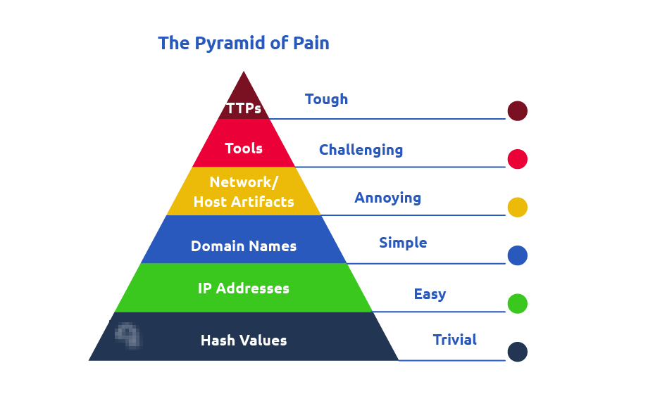

# Pyramid Of Pain

Ce concept bien connu est appliqué aux solutions de cybersécurité telles que:
- [Cisco Security](https://gblogs.cisco.com/ca/2020/08/26/the-canadian-bacon-cisco-security-and-the-pyramid-of-pain/)
- [SentinelOne](https://www.sentinelone.com/blog/revisiting-the-pyramid-of-pain-leveraging-edr-data-to-improve-cyber-threat-intelligence/)
- [SOCRadar](https://socradar.io/re-examining-the-pyramid-of-pain-to-use-cyber-threat-intelligence-more-effectively/) 

Pour améliorer l'efficacité des exercices de CTI (Cyber ​​Threat Intelligence), de chasse aux menaces et de réponse aux incidents.

## Hash Values (Trivial)

Divers outils en ligne peuvent être utilisés pour effectuer des recherches de hachage, comme [VirusTotal](https://www.virustotal.com/gui/) et [Metadefender Cloud - OPSWAT](https://metadefender.opswat.com/?lang=en) .

## IP Address (Easy)
La connaissance des adresses IP utilisées par un adversaire permet bloquer, abandonner ou refuser les demandes entrantes provenant d'adresses IP sur votre paramètre ou votre pare-feu externe. 

L'un des moyens par lesquels un adversaire peut rendre difficile la réalisation d'un blocage IP consiste à utiliser  Fast Flux .

>  Fast Flux est une technique DNS utilisée par les botnets pour masquer les activités de phishing, de proxy Web, de diffusion de logiciels malveillants et de communication de logiciels malveillants derrière des hôtes compromis agissant comme des proxys. 
>
> L’objectif de l’utilisation du réseau Fast Flux est de rendre la communication entre les logiciels malveillants et leur serveur de commande et de contrôle (C&C) difficile à découvrir par les professionnels de la sécurité.

Ainsi, le concept principal d'un réseau Fast Flux est d'avoir plusieurs adresses IP associées à un nom de domaine, qui est en constante évolution.

En savoir plus : [Fast Flux 101 : Comment les cybercriminels améliorent la résilience de leur infrastructure pour échapper à la détection et aux démantèlements des forces de l'ordre.](https://unit42.paloaltonetworks.com/fast-flux-101/)

## Domain Name (Simple)

Les noms de domaine peuvent être un peu plus difficiles à modifier pour l'attaquant, car il devra probablement acheter le domaine, l'enregistrer et modifier les enregistrements DNS. 

Malheureusement pour les défenseurs, de nombreux fournisseurs DNS fournissent des API pour permettre à l'attaquant de changer encore plus facilement de domaine.

> Punycode est un moyen de convertir des mots qui ne peuvent pas être écrits en ASCII en un codage Unicode ASCII.

les attaquants utilisent les services de raccourcissement d'URL suivants pour générer des liens malveillants : 

- bit.ly
- goo.gl
- ow.ly
- s.id
- smarturl.it
- minuscule.pl
- tinyurl.com
- x.co

## Host Artifacts (Annoying)
Les artefacts de l'hôte sont les traces ou les observables que les attaquants laissent sur le système, tels que les valeurs de registre, l'exécution de processus suspects, les modèles d'attaque ou IOC (indicateurs de compromission), les fichiers supprimés par des applications malveillantes ou tout autre élément exclusif à la menace actuelle.

## Network Artifacts (Annoying)
Un artefact réseau peut être une chaîne d'agent utilisateur, des informations C2 ou des modèles d'URI suivis par les requêtes HTTP POST.

Voici les chaînes User-Agent les plus courantes trouvées pour le [cheval de Troie Emotet Downloader.](https://www.mcafee.com/blogs/other-blogs/mcafee-labs/emotet-downloader-trojan-returns-in-force/)

> Si vous parvenez à détecter les chaînes User-Agent personnalisées utilisées par l'attaquant, vous pourrez peut-être les bloquer, créant ainsi d'avantage d'obstacles et rendant sa tentative de compromettre le réseau plus ennuyeuse

## Tools (Challeging)
Les signatures antivirus, les règles de détection et les règles YARA peuvent être d’excellentes armes à utiliser contre les attaquants à ce stade.

[MalwareBazaar](https://bazaar.abuse.ch/)  et  [Malshare](https://malshare.com/)  sont de bonnes ressources pour vous donner accès aux échantillons, aux flux malveillants et aux résultats YARA – tout cela peut être très utile lorsqu'il s'agit de traquer les menaces et de répondre aux incidents.

Pour les règles de détection, [ SOC Prime Threat Detection Marketplace](https://tdm.socprime.com/) est une plate-forme sur laquelle les professionnels de la sécurité partagent leurs règles de détection pour différents types de menaces, y compris les dernières CVE exploitées dans la nature par des adversaires.

**Le hachage flou** est également une arme puissante contre les outils de l'attaquant. Le hachage flou vous aide à  effectuer une analyse de similarité : faites correspondre deux fichiers présentant des différences mineures en fonction des valeurs de hachage floues. 

## TTPs (Tough)

Si vous parvenez à détecter et à répondre rapidement aux TTP, vous ne laissez pratiquement aucune chance à vos adversaires de riposter.  

Par exemple, si vous pouviez détecter une attaque [Pass-the-Hash](https://www.beyondtrust.com/resources/glossary/pass-the-hash-pth-attack) à l'aide de la surveillance du journal des événements Windows et y remédier, vous seriez en mesure de trouver l'hôte compromis très rapidement et d'arrêter le mouvement latéral à l'intérieur de votre réseau .