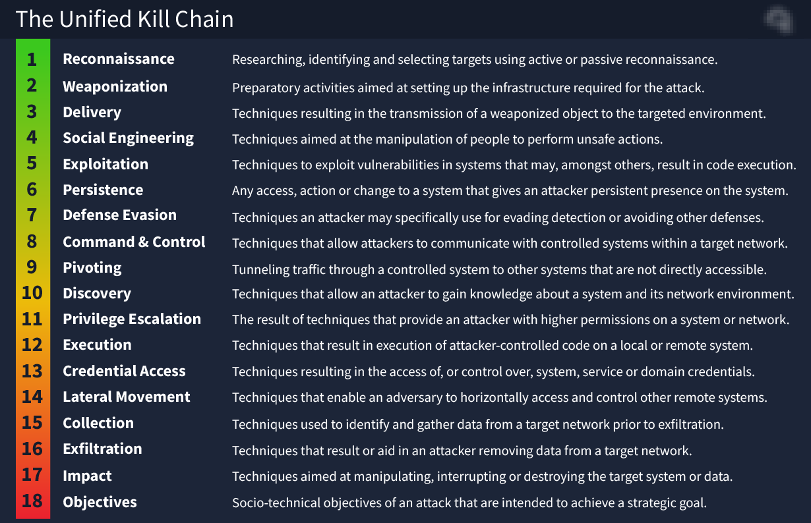

# Unified Kill Chain

L'UKC déclare qu'une attaque comporte 18 phases : de la reconnaissance à l'exfiltration de données et à la compréhension des motivations de l'attaquant.

Certaine phase sont tres similaire au [Cyber Kill Chain](Cyber%20Kill%20Chain.md)

| **Avantages du cadre Unified Kill Chain ( UKC )**                                                                                          |
| ------------------------------------------------------------------------------------------------------------------------------------------------------------------------------------------------------------------------------------- |
| Moderne (sorti en 2017, mis à jour en 2022).                                                        |
| L' UKC est extrêmement détaillé (18 phases).                                                      |
| L'UKC couvre l'intégralité d'une attaque, depuis la reconnaissance jusqu'à l'exploitation et la post-exploitation, et inclut l'identification de la motivation de l'attaquant.                                                        |
| L’ UKC met en avant un scénario d’attaque bien plus réaliste. Diverses étapes se reproduiront souvent. Par exemple, après avoir exploité une machine, un attaquant va entamer une reconnaissance pour faire pivoter un autre système. |

## Phase 1 : In (prise initiale)
- Reconnaissance
- Weaponization
- Social Engineering
- Exploitation
- Persistence
- Defence Evasion
- Command & control
- Pivoting

## Phase 2 : À travers (propagation du réseau)
- Discovery
- Privilege Escalation
- Execution
- Credential Access
- Lateral Movement

## Phase 3 : Sortie (Action sur les objectifs)
- Collection
- Exfiltration
- Impact
- Objectifs