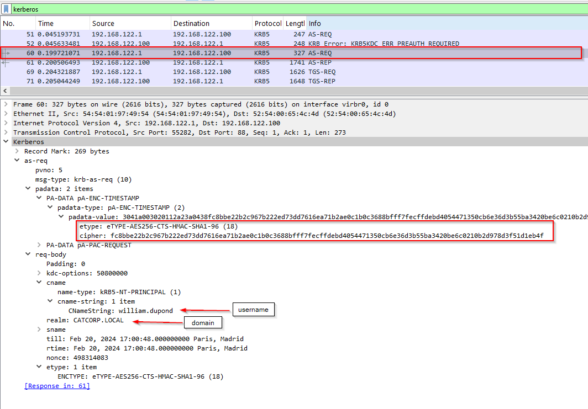

# Wireshark

## Packet Navigation
Wireshark calcule le nombre de paquets étudiés et attribue un numéro unique à chaque paquet.

- **Accéder au paquet**

Permettent de revenir facilement à un point spécifique d'un événement.

```
Go
Go to Packet..
Packet: <NUMBER>
Go to packet
```

- **Trouver des paquets**

Wireshark peut rechercher des paquets en fonction de leur contenu.

```
Edit
Find Packet...
Packet details | String: <VALEUR>
```

**Exporter des objets (fichiers)**

Wireshark peut extraire les fichiers transférés via le réseau. L'exportation d'objets n'est disponible que pour les flux de protocoles sélectionnés (DICOM, HTTP , IMF, SMB et TFTP).

```
File
Export Objects
...
```

**Format d'affichage de l'heure**

Par défaut, Wireshark affiche l'heure en « secondes depuis le début de la capture », l'utilisation courante consiste à utiliser le format d'affichage de l'heure UTC pour une meilleure vue.

```
View
Time Display Format
UTC Date and Time of Fay (...)
```

## Capturing Kerberose Pre-Auth

Si la pré-authentification est désactivée, n’importe qui peut demander un TGT au nom d’un compte, sans envoyer d’authentifiant, et le KDC renverra un `KRB_AS_REP` au demandeur.

Structure d'un hash `AS-REQ` l'hors d'une `Pre-Auth`

```sh
$krb5pa$etype$username$domain$cipher
```



```sh
dipeua@probook:~$ hashcat -a 0 -m 19900 hash.txt /opt/rockyou.txt --show

$krb5pa$18$william.dupond$catcorp.local$fc8bbe22b2c967b222ed73dd7616ea71b2ae0c1b0c3688bfff7fecffdebd4054471350cb6e36d3b55ba3420be6c0210b2d978d3f51d1eb4f:.........
```

Donc la pré-authentification pour le compte de `william.dupond` a été désactiver
