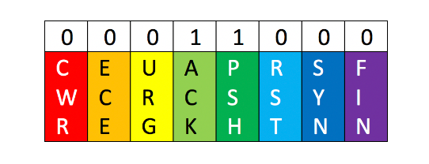

# Options de capture de base
Ces options peuvent être enchaînés pour définir la manière dont la sortie de l'outil nous est affichée dans STDOUT

|          **Options**          | **Résultat**                                                                                                                      |
| :---------------------------: | --------------------------------------------------------------------------------------------------------------------------------- |
|              -D               | Affiche toutes les interfaces disponibles pour la capture.                                                                        |
|              -i               | Sélectionne une interface à partir de laquelle effectuer la capture. ex. `-i eth0`                                                |
|              -n               | Ne résolvez pas les noms d’hôtes.                                                                                                 |
|              -nn              | Ne résolvez pas les noms d’hôtes ou les ports connus.                                                                             |
|              -e               | Récupérera l'en-tête Ethernet ainsi que les données de couche supérieure.                                                         |
|              -X               | Afficher le contenu des paquets en hexadécimal et en ASCII.                                                                       |
|              -XX              | Identique à X, mais spécifiera également les en-têtes Ethernet. (comme en utilisant `Xe`)                                         |
|         -v, -vv, -vvv         | Augmentez la verbosité des sorties affichées et enregistrées.                                                                     |
|              -c               | Prenez un nombre spécifique de paquets, puis quittez le programme.                                                                |
|              -s               | Définit la quantité d'un paquet à récupérer.                                                                                      |
|              -S               | changer les numéros de séquence relatifs dans l'affichage de capture en numéros de séquence absolus. (13248765839 au lieu de 101) |
|              -q               | Imprimez moins d’informations de protocole.                                                                                       |
|        -r fichier.pcap        | Lire à partir d'un fichier.                                                                                                       |
|        -w fichier.pcap        | Écrire dans un fichier                                                                                                            |
| -t , -tt, -ttt, -tttt, -ttttt | Pour gérer les 0 horodatages 1                                                                                                    |
```sh
sudo tcpdump -i (interface) -<options>
sudo tcpdump -i eth0 -nnvXX
```

Ecouter sur un port

```sh
sudo tcpdump port 9001 -A
```

Filtre un fichier `.pcap` de wireshark

```sh
sudo tcpdump -n -r file.pcap
sudo tcpdump -n src host <IP> -r read.pcap
sudo tcpdump -n dst host <IP> -r read.pcap
sudo tcpdump -n port <PORT> -r read.pcap
```

# Packet Filtering

| **Filtre**         | **Résultat**                                                                                                                               |
| ------------------ | ------------------------------------------------------------------------------------------------------------------------------------------ |
| host               | `host`filtrera le trafic visible pour afficher tout ce qui implique l'hôte désigné. Bidirectionnel                                         |
| src / dst          | `src`et `dest`sont des modificateurs. Nous pouvons les utiliser pour désigner un hôte ou un port source ou de destination.                 |
| filet              | `net`nous montrera tout trafic provenant ou destiné au réseau désigné. Il utilise la notation /.                                           |
| proto              | filtrera pour un type de protocole spécifique. (Ether, TCP, UDP et ICMP par exemples)                                                      |
| port               | `port`est bidirectionnel. Il affichera tout trafic avec le port spécifié comme source ou destination.                                      |
| portrange          | `portrange`nous permet de spécifier une plage de ports. (0-1024)                                                                           |
| less / greate "<>" | `less`et `greater`peut être utilisé pour rechercher un paquet ou une option de protocole d'une taille spécifique.                          |
| and / &&           | `and` `&&`peut être utilisé pour concaténer deux filtres différents ensemble. par exemple, l'hôte src ET le port.                          |
| or                 | `or`permet une correspondance sur l'une des deux conditions. Il n'est pas nécessaire que les deux soient remplies. Cela peut être délicat. |
| not                | `not`est un modificateur qui dit tout sauf x. Par exemple, pas UDP.                                                                        |
```sh
sudo tcpdump <filtering> [<options>]
```

```sh
sudo tcpdump -i (interface) host (ip)
sudo tcpdump -i (interface) port (#)
sudo tcpdump -i (interface) proto (#)
sudo tcpdump -i (interface) (protoname)
```

# Spécification des indicateurs TCP

1. Pour faire correspondre tous les paquets avec _`un seul indicateur TCP`_ spécifié :

```
tcp[tcpflags] == tcp-ack/tcp-syn/tcp-fin/tcp-push/tcp-urg/tcp-rst
```

Par exemple, ceci affiche les paquets dont seul l'indicateur `PSH` est activé.

```
tcp[tcpflags] == tcp-push
```

2. Pour faire correspondre des paquets comportant _`plusieurs indicateurs TCP`_  spécifié :

- On doit convertir les indicateurs en une valeur décimale et utilisez ce nombre dans 

```
tcp[tcpflags] == x
```



Par exemple, pour les paquets dont les indicateurs `PSH` et `ACK` sont définis, la valeur décimale devient `00011000 = 24`, et l'expression devient 

```
tcp [tcpflags] == 24
```


