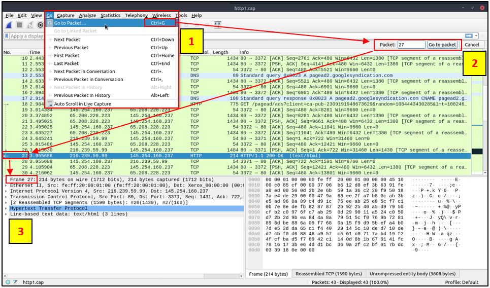
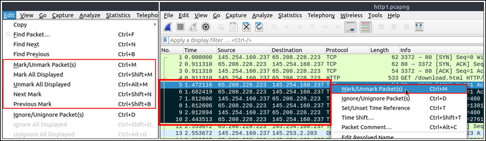
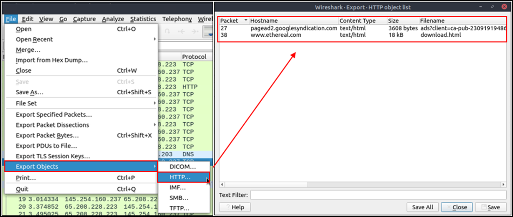
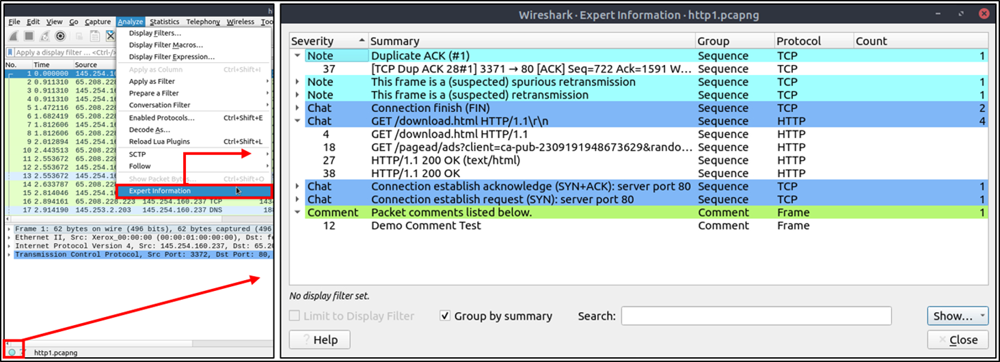
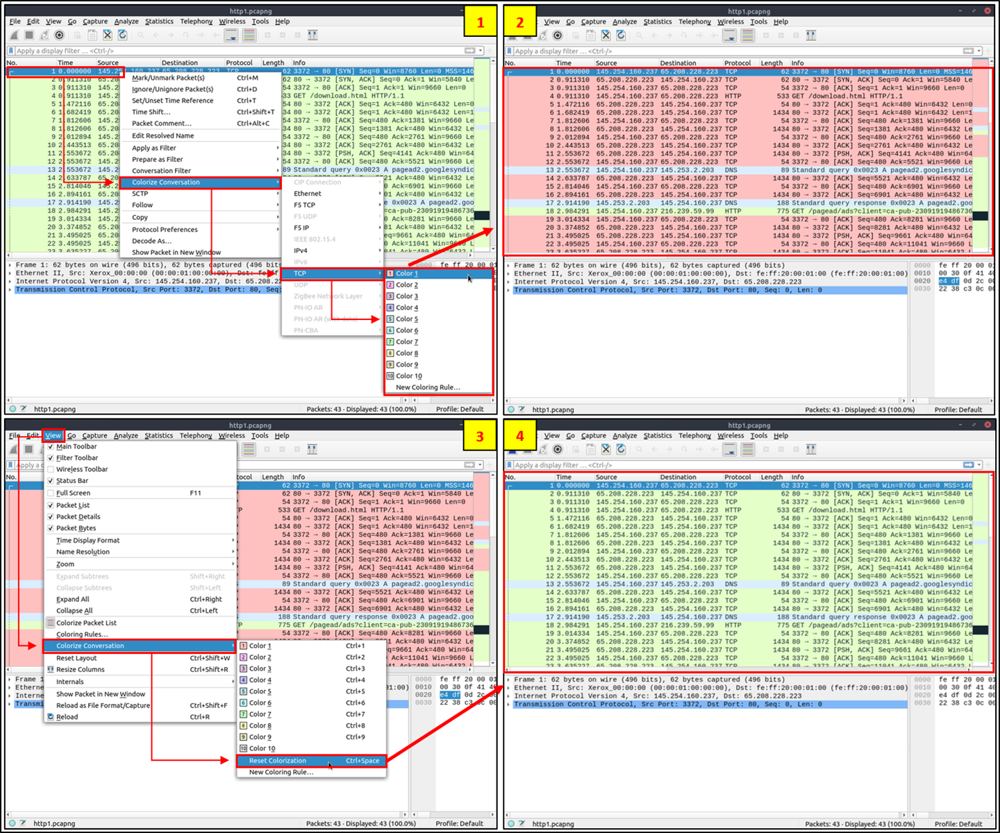
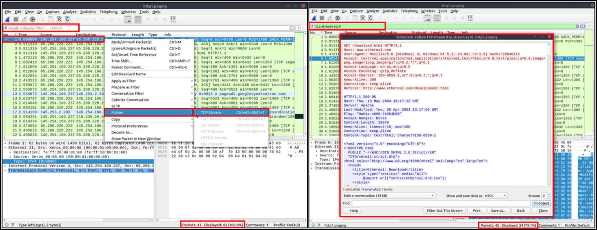

# Packet Dissection
La dissection de paquets ou dissection de protocole, étudie les détails des paquets en décodant les protocoles et les champs disponibles.

Les paquets se composent de 5 à 7 couches basées sur le modèle OSI.

- Couche 1 : Montre quelle trame/paquet vous regardez et les détails spécifiques à la couche physique.

- Couche 2 : Montre les adresses MAC source et de destination à partir de la couche de liaison de données.

- Couche 3 : Montrera les adresses IPv4 source et de destination à partir de la couche réseau.

- Couche 4 : Montrera les détails du protocole utilisé ( UDP / TCP ) et les ports source et de destination à partir de la couche transport.

- Erreurs de protocole : Cette continuation de la 4ème couche montre des segments spécifiques de TCP qui devaient être réassemblés.

- Couche 5 : Cette option affiche les détails spécifiques au protocole utilisé, tels que HTTP , FTP et SMB . À partir de la couche Application

- Données d'application :  Cette extension de la 5ème couche peut afficher les données spécifiques à l'application.

# Packet Navigation
Wireshark calcule le nombre de paquets étudiés et attribue un numéro unique à chaque paquet.

**Accéder au paquet**
Permettent de revenir facilement à un point spécifique d'un événement.

**Trouver des paquets**
Wireshark peut rechercher des paquets en fonction de leur contenu.

**Marquer les paquets**
Les paquets marqués seront affichés en noir quelle que soit la couleur d'origine représentant le type de connexion.

**Commentaires sur le paquet**
Similairement au marquage des paquets, les commentaires aideront à l'investigation ultérieure ou rappelleront et signaleront des points importants/suspects aux autres analystes de la couche.

Contrairement au marquage des paquets, les commentaires peuvent rester dans le fichier de capture jusqu'à ce que l'opérateur les supprime.

**Exporter des objets (fichiers)**
Wireshark peut extraire les fichiers transférés via le réseau. L'exportation d'objets n'est disponible que pour les flux de protocoles sélectionnés (DICOM, HTTP , IMF, SMB et TFTP).

**Format d'affichage de l'heure**
Par défaut, Wireshark affiche l'heure en « secondes depuis le début de la capture », l'utilisation courante consiste à utiliser le format d'affichage de l'heure UTC pour une meilleure vue.

**Informations d'expert**
Wireshark détecte également des états spécifiques de protocoles pour aider les analystes à repérer facilement d'éventuelles anomalies et problèmes.
 
Notez qu'il ne s'agit que de suggestions et qu'il existe toujours un risque d'obtenir de faux positifs/négatifs. 

# Packet Filtering

**Coloriser la conversation**
Met en évidence les paquets liés sans appliquer de filtre d'affichage et diminue le nombre de paquets visualisés.

**Appliquer comme colonne**

**Suivre le flux**
Wireshark affiche tout en taille de portion de paquet. Cependant, il est possible de reconstituer les flux et d'afficher le trafic brut tel qu'il est présenté au niveau de l'application et est également possible d'afficher les données de protocole non chiffrées

